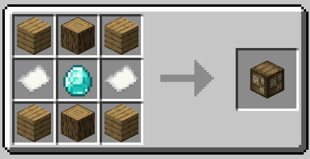

# Bounty Boards

Bounty Boards are boards where you can pick up and turn in Bounties. 
They can be found throughout the world (as long as village generation is
turned on in the config), or they can be crafted.

Over time, new Bounties will come and go. The Bounties that show up on
a given Board are dependent on that Board's [Decrees](decrees.md), and their rarity
depends on the [Reputation](reputation.md) level of the Board itself.

The objectives and rewards that show up at a Bounty Board are themed based on an item
called a [Decree](decrees.md). Every Board starts with it's own Decree, and up to three
Decrees can fit on a Board at once. 

One thing to note is that *everyone* 'sees' the same Bounties when viewing the inventory
of a Bounty Board. However, players 'see' their own copy of the board's inventory.
This means that you can take a Bounty from the Board and it won't disappear from your
friend's board. This means that if you see a particularly good bounty, you can tell
your friends so that they can pick up their own copy!

## Recipe

