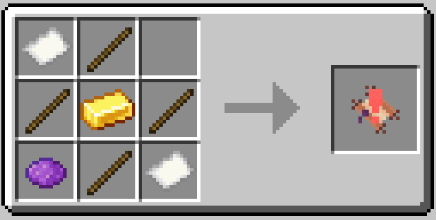

# Decrees

Decrees are items in Bountiful that determine what bounties show up on a
[Bounty Board](bounty-boards.md). They all adhere to a particular theme - for example,
the "Armorer" Decree changes the Board so that all new bounties will have objectives
and rewards related to armorsmithing. The "Farming" Decree adds new bounties related to
farming. These Decrees can be mix-and-matched at a Board, too! If you put both an Armorsmithing
and a Farming Decree on the same Board, you might see Bounties show up that ask you
to bring back some wheat in return for iron armor!
* Note: As of 1.20.4+, decree mixing can be disabled via the config (`bounty.allowDecreeMixing`).

## Recipe

